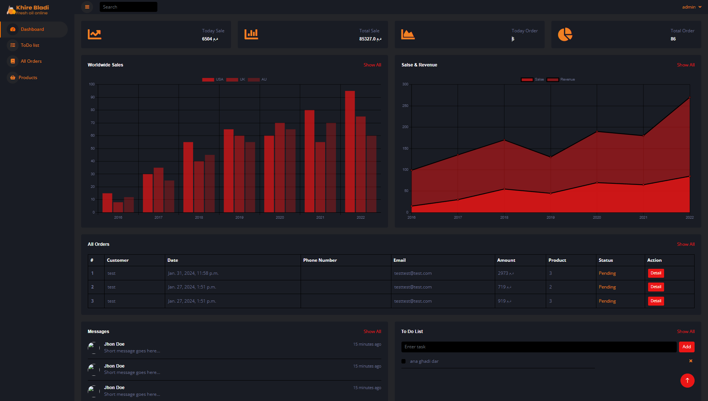

# Family eCommerce Website
<p align="center">
    
</p>
<p align="center">
    
</p>
<p align="center">
    <a href="#Git" alt="Git">
        
    </a>
    <a href="https://github/OZX-OG" alt="Github">
        
    </a>
    <a href="https://www.djangoproject.com/" alt="Django">
        
    </a>
    <a href="https://python.org/" alt="Python">
        
    </a>
    <a href="https://core.telegram.org/bots/tutorial" alt="telegram">
        
    </a>
</p>

This Django-based eCommerce website is developed for my family's business. It consists of three main apps, utilizes media storage for product images, includes a dashboard accessible only by admins, and incorporates middleware for various functionalities. Additionally, the admin dashboard features AJAX integration and a to-do list, and the project includes a Telegram bot.

## Features:

- **Django Framework:** Utilizes Django, a high-level Python web framework, for rapid development and scalability.
  
- **Three Apps Structure:** Organized into three apps within the Django project for better modularity and maintainability.

- **Media Storage for Products:** Uses Django's media storage to manage and serve product images.

- **Admin Dashboard:** Includes a dedicated dashboard accessible only by admins for managing products, orders, and other site functionalities.

- **Middleware:** Implements middleware for handling various tasks such as logging, authentication, and request/response modification.

- **AJAX Integration:** Utilizes AJAX for seamless and asynchronous communication between the client and server.

- **Admin Dashboard To-Do List:** Provides a to-do list feature within the admin dashboard for managing tasks efficiently.

- **Telegram Bot:** Integrates a Telegram bot for handling specific functionalities or providing notifications.

## Installation

1. Make sure you have Python 3.x installed on your system.

2. Clone the repository:
```bash
git clone https://github.com/OZX-OG/ecom-django.git
```
3. Set Up Virtual Environment:
Ensure you have virtual environments installed on your machine. If not, install them using:
```bash
pip install virtualenv
```

4. Create a Virtual Environment:
Navigate to the project directory and create a virtual environment:
```bash
virtualenv venv
```

5. Activate the Virtual Environment:

   - On Windows:
      ```bash
      venv\Scripts\activate
      ```
      
   - On Unix or MacOS::
      ```bash
      source venv/bin/activate
      ```

6. Install the required packages:

```bash
pip install -r requirements.txt
```

7. Start the Server:
Once all requirements are installed, start the Django server:
```bash
python manage.py runserver
```

8. Access the Portal:
Open a web browser and navigate to the URL displayed in the terminal where the Django server is running:


## Environment Variables:

To properly configure the project, create a `.env` file in the root directory with the following variables:

- `TELEGRAM_TOKEN`: The token for your Telegram bot.
- `TELEGRAM_CHAT_ID`: The chat ID where the bot should send messages.

Example `.env` file:

TELEGRAM_TOKEN=your_telegram_bot_token

TELEGRAM_CHAT_ID=your_telegram_chat_id


Ensure to replace `your_telegram_bot_token` and `your_telegram_chat_id` with your actual values.

## Usage:

- Visit the website and browse through the products.
- To access the admin dashboard, go to `/dashboard/signin/` and enter `admin` as the username and password.

## Contributing

Contributions are always welcome!

Feel free to submit pull requests or open issues for any enhancements or bug fixes.

## Credits:

- **Django Community:** Gratitude to the Django community for providing an excellent framework.
- **Telegram:** Thanks to Telegram for providing an API for bot integration.

## 📝 License

- [MIT License](https://github.com/OZX-OG/ecom-django/blob/master/LICENSE)

